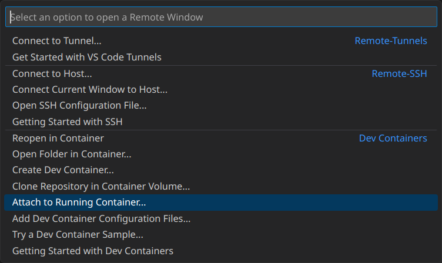

<div align="center">

Creating a Docker Dev Environment  
JDK 17 + Maven + Spring Boot + MariaDB
======================================
</div>

## Introduction

We will be creating a Docker development environment that has two containers; one that has the tools we need for developing a Spring Boot Java application and another one that contains a MariaDB instance our app will be communicating with.

## Writing a Simple Spring Boot App

First we create a Spring Boot app template using [Spring Initializr](https://start.spring.io) with the necessary dependencies. Here we use the following [configuration](https://start.spring.io/#!type=maven-project&language=java&platformVersion=3.0.3&packaging=jar&jvmVersion=17&groupId=com.defia&artifactId=soft&name=soft&description=Docker%20Dev%20Environment%20Example%3A%20JDK%2017%20%2B%20Maven%20%2B%20Spring%20Boot%20%2B%20MariaDB&packageName=com.defia.soft&dependencies=web,data-jpa,mariadb):


Then we unzip the downloaded file in the current folder and rename it to `backend`. Now the directory structure should look like this:
```
./
└── backend/
    ├── .gitignore
    ├── HELP.md
    ├── .mvn/
    │   └── wrapper/
    │       ├── maven-wrapper.jar
    │       └── maven-wrapper.properties
    ├── mvnw*
    ├── mvnw.cmd
    ├── pom.xml
    └── src/
        ├── main/
        │   ├── java/
        │   │   └── com/
        │   │       └── defia/
        │   │           └── soft/
        │   │               └── SoftApplication.java
        │   └── resources/
        │       ├── application.properties
        │       ├── static/
        │       └── templates/
        └── test/
            └── java/
                └── com/
                    └── defia/
                        └── soft/
                            └── SoftApplicationTests.java
```

Let's create a `HelloController.java` file under `backend/src/main/java/com/defia/soft` as a placeholder rest api:
```java
// backend/src/main/java/com/defia/soft/HelloController.java
package com.defia.soft;

import org.springframework.web.bind.annotation.GetMapping;
import org.springframework.web.bind.annotation.RestController;

@RestController
public class HelloController {

	@GetMapping("/")
	public String index() {
		return "Hello World!\n";
	}

}
```

Now we will [stop Spring Boot from auto-configuring the data source](https://www.baeldung.com/spring-boot-failed-to-configure-data-source#3-exclude-datasourceautoconfiguration) according to our dependencies. This will make Spring Boot default to in-memory embedded H2 database and prevent unnecessary errors about database for now:
```ini
# backend/src/main/resources/application.properties
spring.autoconfigure.exclude=org.springframework.boot.autoconfigure.jdbc.DataSourceAutoConfiguration
```

We will come back to this later when we have the database instance set up.

Here is the command to run a Spring Boot app via Maven:
```
mvn spring-boot:run
```

Let's see what we get:
```
$ curl http://localhost:8080
Hello World!
```

If you see this, great! If not, your suffering has only begun. Let's move on to the next step.

## Containerizing our Spring Boot Project

Now we want to containerize this project. It will have the necessary development tools installed like JDK and Git as well as the source of our project.

Let's create a Dockerfile under the `backend` directory with the following contents:
```dockerfile
# syntax=docker/dockerfile:1.4

FROM maven:3.9.0-eclipse-temurin-17

WORKDIR /code

COPY pom.xml pom.xml
RUN mvn dependency:go-offline

# RUN <<EOF
# apt-get update
# apt-get install --assume-yes --no-install-recommends git
# EOF

COPY . .

RUN mvn install

CMD ["mvn", "spring-boot:run"]
```

That's a lot to take in at once so let's go over it piece by piece.

***

```dockerfile
# syntax=docker/dockerfile:1.4
```

First line is a [parser directive](https://docs.docker.com/engine/reference/builder/#parser-directives) that enables some of the newer features for our Dockerfile such as [heredoc](https://en.wikipedia.org/wiki/Here_document#Unix_shells) shell syntax we use for RUN instructions.

***

```dockerfile
FROM maven:3.9.0-eclipse-temurin-17
```

[FROM](https://docs.docker.com/engine/reference/builder/#from) instruction specifies which Docker image we want to build this new image upon. Since we would like to have JDK 17 and Maven installed, we used `maven:3.9.0-eclipse-temurin-17`.

Now I think how we select the image needs some elaboration. For the most part it is chosen based on whatever image provides our needs the best. There are no hard rules about how you should be creating a dev environment image. There are few things I considered while choosing the base image:

- It shouldn't be based on a stripped down distro (e.g. Alpine) so that we don't have to install a bunch of tools we normally expect from a dev environment to be there.
- It should have JDK 17 which is what our project targets.
- It should contain Maven since that's how our project will handle dependency and build management.

My search revealed that [`maven:3.9.0-eclipse-temurin-17`](https://github.com/carlossg/docker-maven/blob/32760466401d45fabb8166b5dcf9003b07598918/eclipse-temurin-17/Dockerfile) pretty much suits my needs so I went with it. It is based on [`eclipse-temurin:17-jdk`](https://github.com/adoptium/containers/blob/main/17/jdk/ubuntu/jammy/Dockerfile.releases.full) which is based on [`ubuntu:22.04`](https://git.launchpad.net/cloud-images/+oci/ubuntu-base/tree/Dockerfile.in?h=refs/tags/dist-jammy-amd64-20230126&id=d4e91f86e34e0de683c46f08178d93fcf83a515d).

It is good practice to use tags that refer to specific versions rather than `latest` etc. which is also what Docker documentation recommends.

One thing to mention is that there doesn't seem to be a fool proof way to know "base image chain" of an image, meaning that when you look at layers of an image either by running `docker image history` or looking it up on Docker Hub you don't see any kind of `FROM` instruction. These are unrolled and also instruction arguments for `ADD` and `COPY` are replaced with vague hash equivalents which makes it harder to understand what exactly is an image based on. Thankfully most official images have links to their original `Dockerfile`s in their readmes where you can figure out the chain manually, and better understand what exactly does an image contain.

You can of course base your image directly on a distro and add instructions to your `Dockerfile` to install JDK, Maven, Git and whatever you need yourself (e.g. via `apt` on Ubuntu or with `apk` on Alpine).

***

```dockerfile
WORKDIR /code
```

[`WORKDIR`](https://docs.docker.com/engine/reference/builder/#workdir) instructs subsequent commands to be ran relative to the given directory. It also creates the necessary folders if the path doesn't exist. Here we create `code` folder in the root `/` directory and change working directory as `/code`.

***

```dockerfile
COPY pom.xml pom.xml
RUN mvn dependency:go-offline
```

In this step we copy `pom.xml` from host (relative to [docker build context](https://docs.docker.com/compose/compose-file/build/#build-definition), more on that later) to container's file system, and then run `mvn dependency:go-offline` which basically downloads all dependencies from our project's dependency chain so that a build later on doesn't need to trigger downloading missing libraries.

Copying `pom.xml` separately is so that we can take advantage of Docker's build caching in case we build this image again. If we were to copy the whole `backend` folder, any change we do in other parts of the source would invalidate caches for the instructions above and would re-download dependencies.

***

```dockerfile
COPY . .
RUN mvn install
```

Here we copy the project source tree and make sure it compiles without issues. If the build command returns with a non-zero code the image build fails. You may want to check out [Maven docs](https://maven.apache.org/guides/introduction/introduction-to-the-lifecycle.html#build-lifecycle-basics) for the `install` phase.

Despite running `mvn dependency:go-offline` prior to this, `mvn install` still downloads some more dependencies, probably because Maven sucks ass.

***

```dockerfile
# RUN <<EOF
# apt-get update
# apt-get install -y --no-install-recommends git
# EOF
```

Here we update apt local package registry and install Git using the heredoc shell syntax. Running multiple commands like this will create a single image layer. It is recommended to never put `apt update` in its own layer because it will cause apt to use outdated registry information for installing packages the next time we build this image again.

I commented it out because to my surprise Maven image already comes with `git` installed.

***

```dockerfile
CMD ["mvn", "spring-boot:run"]
```

Finally we specify that the container should run our Spring Boot app by default when it starts. This may or may not be what you want since this is a dev environment rather than a container built for specifically running the app itself. You can change it to something like:
```dockerfile
CMD ["sleep", "infinity"]
```

> Beware that `sleep` doesn't do anything to handle signals. Normally this means the process exits which is what we want, except this behaves differently for a process with PID=1. If the process with an id of 1 does not handle a signal, it will be ignored.
> 
> To circumvent this we can instead tell docker to inject an `init` process that does the correct thing and forwards signals to our process (`sleep`) by using `docker run --init` or adding `init: true` to the `compose.yaml` file.

You may also default to shell if you want to fall into a command prompt when you `docker run -it` or `docker start -ai`:
```dockerfile
STOPSIGNAL SIGHUP
CMD ["bash", "--login"]
```

Note that we add [`STOPSIGNAL`](https://docs.docker.com/engine/reference/builder/#stopsignal) [`SIGHUP`](https://en.wikipedia.org/wiki/SIGHUP) as shells usually ignore `SIGTERM` which is the default signal sent by the docker when you run the `docker stop` command.

***

> Notes on rootless containers:
> 
> You will find countless pages on the net about how containers should not be run as root and how you can reduce potential security risks by creating a regular user and switching to it via the [`USER`](https://docs.docker.com/engine/reference/builder/#user) instruction. Docker's documentation is unfortunately total garbage and doesn't explain anything properly with details. It turns out Docker Desktop already runs the Docker daemon as the current user (as opposed to root like plain Docker Engine) and maps that user to the root inside the containers. Trying to use a regular user results in all sorts of ugly issues which I don't want to get into, try it out and see for yourself if you feel adventurous.

## Fusing with a Database

Now that we created our app container, we're going to add the database ([MariaDB](https://mariadb.org) in our case) to the equation. We will be using [Docker Compose](https://docs.docker.com/compose/) to bring them together into a multi-container Docker application.

Latest stable is [`mariadb:10.11.2-jammy`](https://github.com/MariaDB/mariadb-docker/blob/97200971ae9d24a700acc65055eaf9edc4df91f1/10.11/Dockerfile) as of writing this so that's what we will use.

[Docker Hub page for MariaDB](https://hub.docker.com/_/mariadb) includes documentation on how to configure and use the image. These can vary between different databases/images and therefore is up to the reader to adapt for their case.

At a minimum MariaDB needs a root password (database user; not OS user). Let's create a folder named `db` alongside our `backend` folder and then create two files called `db-rootpass` and `db-userpass` inside it. Fill them in with passwords you would like to use. Directory structure should now look like this:
```
./
├── backend/
│   ├── Dockerfile
│   ├── .gitignore
│   ├── HELP.md
│   ├── .mvn/
│   │   └── wrapper/
│   │       ├── maven-wrapper.jar
│   │       └── maven-wrapper.properties
│   ├── mvnw*
│   ├── mvnw.cmd
│   ├── pom.xml
│   └── src/
│       ├── main/
│       │   ├── java/
│       │   │   └── com/
│       │   │       └── defia/
│       │   │           └── soft/
│       │   │               ├── HelloController.java
│       │   │               └── SoftApplication.java
│       │   └── resources/
│       │       ├── application.properties
│       │       ├── static/
│       │       └── templates/
│       └── test/
│           └── java/
│               └── com/
│                   └── defia/
│                       └── soft/
│                           └── SoftApplicationTests.java
└── db/
    ├── .editorconfig
    ├── rootpass.txt
    └── userpass.txt
```

Now is the time for bringing this all with Docker Compose. Let's create a `compose-dev.yaml` file alongside the `backend` and `db` folders and start shaping up our multi-container setup:
```yaml
services:
  backend:
    build: backend
    ports:
      - 8080:8080
    environment:
      - DB_DATABASE=main
      - DB_USER=spring
      - DB_PASSWORD_FILE=/run/secrets/db-userpass
    volumes:
      - ./backend:/code
    networks:
      - maria
    secrets:
      - db-userpass
    depends_on:
      - db
      # db:
      #   condition: service_healthy
  db:
    image: mariadb:10.11.2-jammy
    restart: always
    # healthcheck:
    #   test: healthcheck.sh --connect
    #   interval: 5s
    #   timeout: 10s
    #   retries: 10
    expose:
      - 3306
    environment:
      - MARIADB_ROOT_PASSWORD_FILE=/run/secrets/db-rootpass
      - MARIADB_DATABASE=main
      - MARIADB_USER=spring
      - MARIADB_PASSWORD_FILE=/run/secrets/db-userpass
    volumes:
      - db-data:/var/lib/mysql/data
    networks:
      - maria
    secrets:
      - db-rootpass
      - db-userpass
volumes:
  db-data:
secrets:
  db-rootpass:
    file: db/rootpass.txt
  db-userpass:
    file: db/userpass.txt
networks:
  maria:
```

That's quite some config we got here, so let's go over it together.

***

```yaml
services:
  backend:
    build: backend
```

Here we define our Spring Boot app named `backend` and tell Docker that it should [build](https://docs.docker.com/compose/compose-file/build/) the Dockerfile inside the `backend` directory and use that as our base image for this service (read: container). Build context is `backend` directory when the shorthand syntax is used like we did here.

***

```yaml
    ports:
      - 8080:8080
```

Not much to see here, this is where we specify a list of ports that will be mapped between the container and the host, allows us to access the app from the host (e.g. we can checkout http://localhost:8080 in browser).

***

```yaml
    environment:
      - DB_DATABASE=main
      - DB_USER=spring
      - DB_PASSWORD_FILE=/run/secrets/db-userpass
```

I've put these environment variables here so that we can load them dynamically in our Spring app. We could instead put these inside `application.properties` but since we're using [secrets](https://docs.docker.com/compose/compose-file/#secrets) feature of Docker Compose we will be reading them from the corresponding file at startup instead.

***

```yaml
    volumes:
      - ./backend:/code
```

This defines a [bind mount](https://docs.docker.com/storage/bind-mounts/) relative to the `compose-dev.yaml` file we're working on. It maps `backend` folder in our host machine to `/code` path in the container. Docker documentation recommends relative paths to be written with `./` or `../` prefixes to avoid ambiguities with named [volumes](https://docs.docker.com/storage/volumes/).

What it enables us is that we can access these both from the host and the container. This is an important part that need some clarification about what it means for tooling.

[VS Code](https://code.visualstudio.com) has [pretty good support](https://code.visualstudio.com/docs/devcontainers/containers) for Docker Dev Environments and is capable of running a headless (non-GUI) instance inside a container and connect to it from a GUI-only instance that runs on your host. This is the most compatible setup that is recommended for most users. Interactive terminal editors such as `nano`, `vim`, `emacs` etc. will also work quite well, you can run them inside the container and use them from a host terminal without much effort.

Running [IntelliJ IDEA](https://www.jetbrains.com/idea/) on the other hand is going to be a challenge since it doesn't support a headless+GUI Docker integration as of writing this. What you can do of course is to develop on your host just like you would normally do and let Docker synchronize any changes in bind mounts to the container (and vice versa). This has the caveat that things like auto-completion won't pickup libraries inside the container, so you would need to have those on the host as well to make that work.

At this point, you may be wondering what we even gain from using containers if we need to replicate tons of things in the host as well. The answer is... not much. Still, there few things it helps us with:
- Allow someone to easily spin up an isolated environment where the project can be built & run.
- Ensures that unrelated changes to you host environment does not affect build or runtime behavior of your project.
- Allow us to run multiple instances of the same service or database without making a mess of them in the same environment.

Whether trade-offs of using containers is worth for you and your team need some decision making on your part.

***

```yaml
    networks:
      - maria
```

Defines which [networks](https://docs.docker.com/compose/compose-file/#networks) this container will have access to. These named [networks](https://docs.docker.com/compose/compose-file/#networks-top-level-element) are defined separately at the bottom of our yaml file.

***

```yaml
    secrets:
      - db-userpass
```

This tells Docker what secrets will be made available to this container. These are mounted into `/run/secrets/` (e.g. `/run/secrets/db-userpass`).

***

```yaml
    depends_on:
      - db
      # db:
      #   condition: service_healthy
```

[`depends_on`](https://docs.docker.com/compose/compose-file/#depends_on) tells Docker to start `db` service before `backend`. Not terribly useful without a `condition: service_healthy` field in which case the `backend` will only be started after `db` status becomes [healthy](https://docs.docker.com/engine/reference/builder/#healthcheck). You can customize how this status is decided on.

For the most part you can omit this and add some logic into your app to wait for database connection to be available, preferably with a reasonable timeout. This is what we will do in our backend code but I've put a commented out example for the curious.

***

```yaml
  db:
    image: mariadb:10.11.2-jammy
```

Here we define our `db` service with an image rather than a build like we did with the `backend` service.

You may also want to create a custom image based on `mariadb` and initialize your database schema with some premade `.sql` files. Alternatively you can add these logic into you app where you check if the database has all the stuff you want and create tables that you think are missing. Spring also provides a very similar mechanism where it picks up `schema.sql` and `data.sql` files from the `resources` folder. This feature can be enabled with the `spring.sql.init.mode` property.

***

```yaml
    restart: always
```

This instructs Docker to always [restart](https://docs.docker.com/compose/compose-file/#restart) the container until its removal.

***

```yaml
    # healthcheck:
    #   test: healthcheck.sh --connect
    #   interval: 5s
    #   timeout: 10s
    #   retries: 10
```

These define how [health check](https://docs.docker.com/engine/reference/builder/#healthcheck) should be tested. Useful to know if you're planning on using that `condition: service_healthy` option mentioned earlier.

***

```yaml
    secrets:
      - db-rootpass
      - db-userpass
```

Which secrets `db` container will have access to.

***

```yaml
    volumes:
      - db-data:/var/lib/mysql/data
```

Defines a named [volume](https://docs.docker.com/storage/volumes/) for `db` service so that database is synchronized on the host.

***

```yaml
    networks:
      - maria
```

Defines which [networks](https://docs.docker.com/network/) `db` has access to. In order for our Spring app to be able to communicate with MariaDB instance they need to have access to the same network.

***

```yaml
    environment:
      - MARIADB_ROOT_PASSWORD_FILE=/run/secrets/db-rootpass
      - MARIADB_DATABASE=main
      - MARIADB_USER=spring
      - MARIADB_PASSWORD_FILE=/run/secrets/db-userpass
```

Environment variables for MariaDB configuration. As mentioned before these are defined according to the [MariaDB image](https://hub.docker.com/_/mariadb) [documentation](https://github.com/docker-library/docs/tree/master/mariadb#environment-variables).

***

```yaml
    expose:
      - 3306
```

[`expose`](https://docs.docker.com/compose/compose-file/#expose) will make given ports visible to other containers that have access to the same network. 3306 is the default connection port for MariaDB and MySQL. Notice that this is different from `ports` directive which opens a bridge between host and containers.

***

```yaml
volumes:
  db-data:
```

Defines named [volume](https://docs.docker.com/compose/compose-file/#volumes-top-level-element) we've used in `db` service above.

***

```yaml
secrets:
  db-rootpass:
    file: db/rootpass.txt
  db-userpass:
    file: db/userpass.txt
```

Defines [secrets](https://docs.docker.com/compose/compose-file/#secrets) we've used in our services above.

***

```yaml
networks:
  maria:
```

Defines named [networks](https://docs.docker.com/compose/compose-file/#networks-top-level-element) we gave access to our services above.

## Firing Up

Now is the time to kickoff the engine and see what we get:
```
$ docker compose up --build
no configuration file provided: not found
```

We've ran into yet another careless oversight by the Docker devs: `compose-dev.yaml` is not recognized by the CLI command. You can either create a symbolic link via `ln -s -T compose-dev.yaml compose.yaml` or explicitly give a `--file` argument as in `docker compose --file compose-dev.yaml up --build`.

After successfully starting up we should be able see the `Hello World!` message again:
```
$ curl http://localhost:8080
Hello World!
```

Nice. We've successfully set up a Docker Dev Environment™. You can build the project, edit files and goof around but without some good IDE integration it's pretty far from what an actual development environment looks like. Time to fix that.

## Setting Up VS Code Integration

VS Code [supports](https://code.visualstudio.com/docs/devcontainers/containers) connecting to a Docker container via the [Remote Development](https://marketplace.visualstudio.com/items?itemName=ms-vscode-remote.vscode-remote-extensionpack) extension pack, so make sure it's installed:
```
ext install ms-vscode-remote.vscode-remote-extensionpack
```

You should now see a green button on the lower left corner:


Clicking it will show us the following available commands:



Click "Attach to Running Container..." to get a list of containers running on the machine and select the one that has `backend` in the name:


VS Code will open up a new window and start setting up the container session. This might take a bit of time.

We should now be able open the `/code` folder:


VS Code will most likely recommend the *Java Extension Pack* as you open the project folder. Let's install it so we get things like auto-completion:


Now that everything is in place, we can start hacking inside the container via VS Code. Good luck dealing with braindead Java and its overengineered piece of utter crapware called Spring.

## Database Connection

So currently our app does not connect to the MariaDB instance just yet. Let's tweak our Spring Boot app for something more interesting and make use of that MariaDB instance we've initialized.

We've mentioned before that we will be reading database config at startup:
```java
// backend/src/main/java/com/defia/soft/DataSourceConfig.java
package com.defia.soft;

import java.io.IOException;
import java.nio.file.Files;
import java.nio.file.Paths;

import javax.sql.DataSource;

import org.springframework.boot.jdbc.DataSourceBuilder;
import org.springframework.context.annotation.Bean;
import org.springframework.context.annotation.Configuration;

@Configuration
public class DataSourceConfig {
	@Bean
	public DataSource getDataSource() throws IOException {
		
		String db = System.getenv("DB_DATABASE");
		String user = System.getenv("DB_USER");
		String passwordPath = System.getenv("DB_PASSWORD_FILE");
		
		return DataSourceBuilder.create()
				.driverClassName("org.mariadb.jdbc.Driver")
				.url("jdbc:mariadb://db:3306/" + db)
				.username(user)
				.password(Files.readString(Paths.get(passwordPath)))
				.build();
	}
}
```

Pretty straightforward stuff, we read configurations from environment variables we defined in our `compose-dev.yaml` file before.

Time for some framework rituals. Let's define a JPA entity class:
```java
// backend/src/main/java/com/defia/soft/Human.java
package com.defia.soft;

import jakarta.persistence.Entity;
import jakarta.persistence.GeneratedValue;
import jakarta.persistence.GenerationType;
import jakarta.persistence.Id;

@Entity
public class Human {

	@Id
	@GeneratedValue(strategy = GenerationType.AUTO)
	private Long id;
	private String name;

	protected Human() {
	}

	public Human(String name) {
		this.name = name;
	}

	@Override
	public String toString() {
		return String.format(
				"Human[id=%d, name='%s']",
				id, name);
	}

	public Long getId() {
		return id;
	}

	public String getName() {
		return name;
	}
}
```

And a JPA repository class:
```java
// backend/src/main/java/com/defia/soft/HumanRepository.java
package com.defia.soft;

import java.util.List;

import org.springframework.data.repository.CrudRepository;

public interface HumanRepository extends CrudRepository<Human, Long> {

	List<Human> findByName(String name);

	Human findById(long id);
}
```

Let's tweak `application.properties`:
```ini
# spring.autoconfigure.exclude=org.springframework.boot.autoconfigure.jdbc.DataSourceAutoConfiguration

spring.jpa.hibernate.ddl-auto=update
spring.jpa.show-sql=true

spring.sql.init.mode=always
```

And add some sample data via `data.sql`:
```sql
-- backend/src/main/resources/data.sql
REPLACE INTO human (id, name) VALUES(1, "Ahmet Sait");
```

Make sure it [doesn't start until database connection is ready](https://deinum.biz/2020-06-30-Wait-for-database-startup/):
```java
// backend/src/main/java/com/defia/soft/StartupValidator.java
package com.defia.soft;

import java.util.stream.Stream;

import javax.sql.DataSource;

import org.springframework.beans.factory.config.BeanFactoryPostProcessor;
import org.springframework.context.annotation.Bean;
import org.springframework.context.annotation.Configuration;
import org.springframework.jdbc.support.DatabaseStartupValidator;

import jakarta.persistence.EntityManagerFactory;

@Configuration
public class StartupValidator {

	@Bean
	public DatabaseStartupValidator databaseStartupValidator(DataSource dataSource) {
		var dsv = new DatabaseStartupValidator();
		dsv.setDataSource(dataSource);
		return dsv;
	}

	@Bean
	public static BeanFactoryPostProcessor dependsOnPostProcessor() {
		return bf -> {
			// Let beans that need the database depend on the DatabaseStartupValidator
			// like the JPA EntityManagerFactory
			String[] jpa = bf.getBeanNamesForType(EntityManagerFactory.class);
			Stream.of(jpa)
					.map(bf::getBeanDefinition)
					.forEach(it -> it.setDependsOn("databaseStartupValidator"));
		};
	}

}
```

And make use of the database:
```java
// backend/src/main/java/com/defia/soft/HelloController.java
package com.defia.soft;

import java.util.Optional;

import org.springframework.beans.factory.annotation.Autowired;
import org.springframework.web.bind.annotation.GetMapping;
import org.springframework.web.bind.annotation.RequestParam;
import org.springframework.web.bind.annotation.RestController;

@RestController
public class HelloController {
	
	@Autowired
	private HumanRepository humanRepository;

	@GetMapping("/")
	public String index(@RequestParam(value = "id", defaultValue = "0") Long id) {
		Optional<Human> human = humanRepository.findById(id);
		return String.format("Hello %s!\n", human.isPresent() ? human.get().getName() : "World");
	}

}
```

Give it a restart so our changes take effect:
```
docker compose restart
```

Let's check this out:
```
$ curl http://localhost:8080?id=1
Hello Ahmet Sait!
```

If you see this, great! You managed to endure never ending stupidity of Java & Spring combo.

## Bonus: Make Spring Recompile Automatically with File Change

Add this dependency into `pom.xml`:
```xml
		<dependency>
			<groupId>org.springframework.boot</groupId>
			<artifactId>spring-boot-devtools</artifactId>
			<optional>true</optional>
		</dependency>
```

## Bonus: Better `.gitignore`

```ini
# ====
# Java
# ====

# Compiled class file
*.class

# Log file
*.log

# BlueJ files
*.ctxt

# Mobile Tools for Java (J2ME)
.mtj.tmp/

# Package Files #
*.jar
*.war
*.nar
*.ear
*.zip
*.tar.gz
*.rar

# virtual machine crash logs, see http://www.java.com/en/download/help/error_hotspot.xml
hs_err_pid*
replay_pid*

# ======
# Gradle
# ======

.gradle
**/build/
!src/**/build/

# Ignore Gradle GUI config
gradle-app.setting

# Avoid ignoring Gradle wrapper jar file (.jar files are usually ignored)
!gradle-wrapper.jar

# Avoid ignore Gradle wrappper properties
!gradle-wrapper.properties

# Cache of project
.gradletasknamecache

# Eclipse Gradle plugin generated files
# Eclipse Core
.project
# JDT-specific (Eclipse Java Development Tools)
.classpath

# =====
# Maven
# =====

target/
pom.xml.tag
pom.xml.releaseBackup
pom.xml.versionsBackup
pom.xml.next
release.properties
dependency-reduced-pom.xml
buildNumber.properties
.mvn/timing.properties
# https://github.com/takari/maven-wrapper#usage-without-binary-jar
.mvn/wrapper/maven-wrapper.jar

# Eclipse m2e generated files
# Eclipse Core
.project
# JDT-specific (Eclipse Java Development Tools)
.classpath

# =========
# JetBrains
# =========

# Covers JetBrains IDEs: IntelliJ, RubyMine, PhpStorm, AppCode, PyCharm, CLion, Android Studio, WebStorm and Rider
# Reference: https://intellij-support.jetbrains.com/hc/en-us/articles/206544839

# User-specific stuff
.idea/**/workspace.xml
.idea/**/tasks.xml
.idea/**/usage.statistics.xml
.idea/**/dictionaries
.idea/**/shelf

# AWS User-specific
.idea/**/aws.xml

# Generated files
.idea/**/contentModel.xml

# Sensitive or high-churn files
.idea/**/dataSources/
.idea/**/dataSources.ids
.idea/**/dataSources.local.xml
.idea/**/sqlDataSources.xml
.idea/**/dynamic.xml
.idea/**/uiDesigner.xml
.idea/**/dbnavigator.xml

# Gradle
.idea/**/gradle.xml
.idea/**/libraries

# Gradle and Maven with auto-import
# When using Gradle or Maven with auto-import, you should exclude module files,
# since they will be recreated, and may cause churn.  Uncomment if using
# auto-import.
# .idea/artifacts
# .idea/compiler.xml
# .idea/jarRepositories.xml
# .idea/modules.xml
# .idea/*.iml
# .idea/modules
# *.iml
# *.ipr

# CMake
cmake-build-*/

# Mongo Explorer plugin
.idea/**/mongoSettings.xml

# File-based project format
*.iws

# IntelliJ
out/

# mpeltonen/sbt-idea plugin
.idea_modules/

# JIRA plugin
atlassian-ide-plugin.xml

# Cursive Clojure plugin
.idea/replstate.xml

# SonarLint plugin
.idea/sonarlint/

# Crashlytics plugin (for Android Studio and IntelliJ)
com_crashlytics_export_strings.xml
crashlytics.properties
crashlytics-build.properties
fabric.properties

# Editor-based Rest Client
.idea/httpRequests

# Android studio 3.1+ serialized cache file
.idea/caches/build_file_checksums.ser

# =======
# Eclipse
# =======

.metadata
bin/
tmp/
*.tmp
*.bak
*.swp
*~.nib
local.properties
.settings/
.loadpath
.recommenders

# External tool builders
.externalToolBuilders/

# Locally stored "Eclipse launch configurations"
*.launch

# PyDev specific (Python IDE for Eclipse)
*.pydevproject

# CDT-specific (C/C++ Development Tooling)
.cproject

# CDT- autotools
.autotools

# Java annotation processor (APT)
.factorypath

# PDT-specific (PHP Development Tools)
.buildpath

# sbteclipse plugin
.target

# Tern plugin
.tern-project

# TeXlipse plugin
.texlipse

# STS (Spring Tool Suite)
.springBeans

# Code Recommenders
.recommenders/

# Annotation Processing
.apt_generated/
.apt_generated_test/

# Scala IDE specific (Scala & Java development for Eclipse)
.cache-main
.scala_dependencies
.worksheet

# Uncomment this line if you wish to ignore the project description file.
# Typically, this file would be tracked if it contains build/dependency configurations:
#.project

# ========
# NetBeans
# ========

**/nbproject/private/
**/nbproject/Makefile-*.mk
**/nbproject/Package-*.bash
build/
nbbuild/
dist/
nbdist/
.nb-gradle/

# ==================
# Visual Studio Code
# ==================

.vscode/*
!.vscode/settings.json
!.vscode/tasks.json
!.vscode/launch.json
!.vscode/extensions.json
!.vscode/*.code-snippets

# Local History for Visual Studio Code
.history/

# Built Visual Studio Code Extensions
*.vsix

# =====
# Linux
# =====

*~

# temporary files which can be created if a process still has a handle open of a deleted file
.fuse_hidden*

# KDE directory preferences
.directory

# Linux trash folder which might appear on any partition or disk
.Trash-*

# .nfs files are created when an open file is removed but is still being accessed
.nfs*

# =====
# macOS
# =====

# General
.DS_Store
.AppleDouble
.LSOverride

# Icon must end with two \r
Icon

# Thumbnails
._*

# Files that might appear in the root of a volume
.DocumentRevisions-V100
.fseventsd
.Spotlight-V100
.TemporaryItems
.Trashes
.VolumeIcon.icns
.com.apple.timemachine.donotpresent

# Directories potentially created on remote AFP share
.AppleDB
.AppleDesktop
Network Trash Folder
Temporary Items
.apdisk

# =======
# Windows
# =======

# Windows thumbnail cache files
Thumbs.db
Thumbs.db:encryptable
ehthumbs.db
ehthumbs_vista.db

# Dump file
*.stackdump

# Folder config file
[Dd]esktop.ini

# Recycle Bin used on file shares
$RECYCLE.BIN/

# Windows Installer files
*.cab
*.msi
*.msix
*.msm
*.msp

# Windows shortcuts
*.lnk
```
